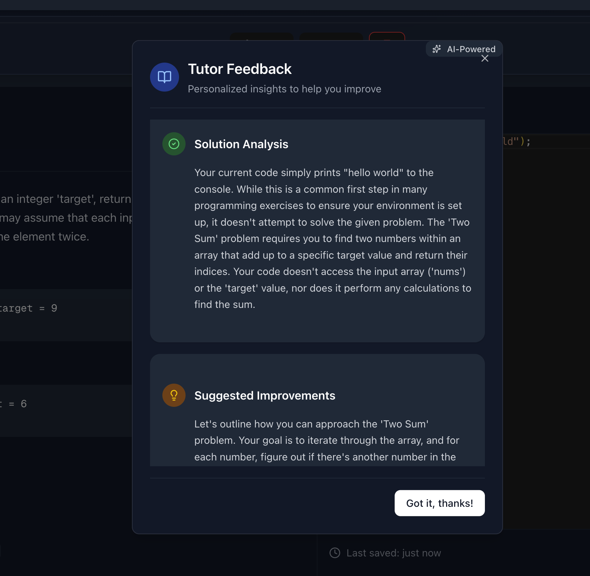

# pair-program
Discuss, Solve and Code together with your friends.

Tech Stack
- Real time updates using Web Sockets (ws library) and CRDT (using Y.js). 
- Livekit for Audio and Video integration.
- Express + Typescript for the backend
- Nextjs with tailwind css

## Join rooms

## Code Together

## AI Question generation (using Gemini)

## Review your solution

## Conflict management
Handled via Y.js (CRDT)

## Running the app
docker compose up (--build if image not there)